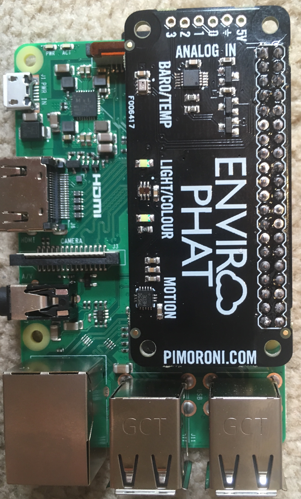
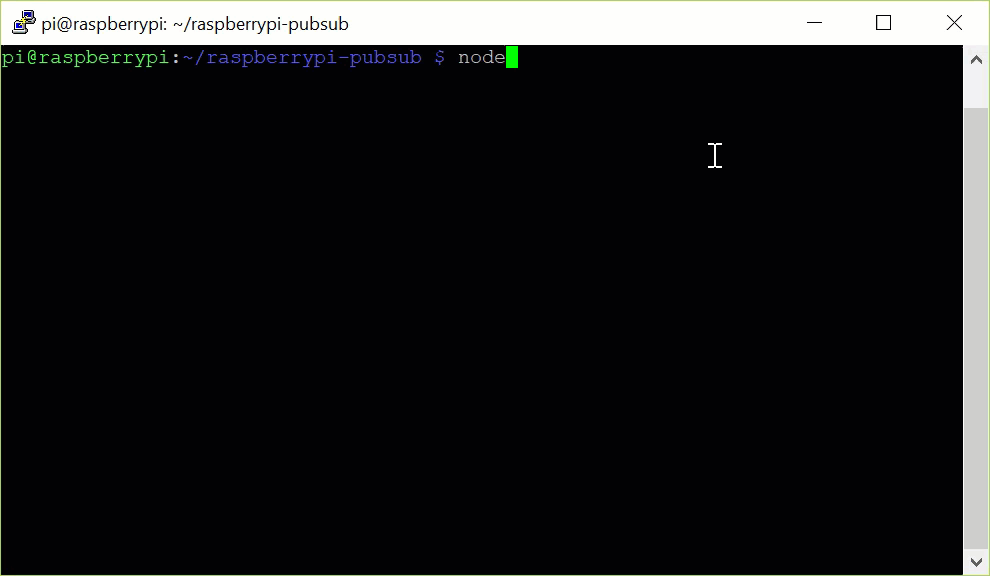
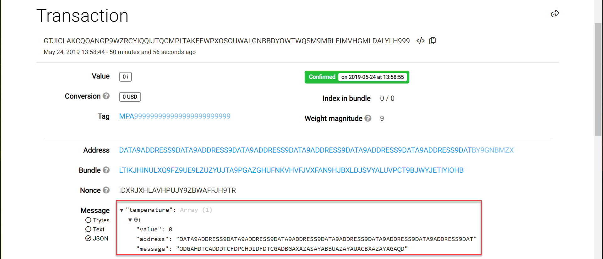

# IOTA Raspberry Pi Demo

This application allows you to use one command to start sending sensor data (the current temperature in Celsius) to the Devnet Tangle.

## Prerequisites

To use this demo, you need the following:

* [An Enviro Phat sensor board](https://shop.pimoroni.com/products/enviro-phat) connected to a Raspberry Pi



* [An LTS version or the latest version of Node.js and NPM](https://nodejs.org/en/download/)

* [Git](https://git-scm.com/download/linux)

For help setting up a Raspberry Pi, you can follow [these instructions](https://medium.com/@lambtho/raspberry-setup-dcb23e8ba88).

For help setting up the Enviro Phat, you can follow the [Soldering guide](https://learn.pimoroni.com/tutorial/sandyj/soldering-phats) and the [Getting started guide](https://learn.pimoroni.com/tutorial/sandyj/getting-started-with-enviro-phat).

## Run the application

1. Clone this repository

  ```
  git clone https://github.com/iota-community/raspberrypi-pubsub
  ```
2. Change into the `raspberrypi-pubsub` directory

  ```bash
  cd raspberrypi-pubsub
  ```
3. Install the dependencies

  ```bash
  npm install
  ```
4. Run the code

  ```bash
  node index.js
  ```

In the console, you should see that the current temperature in Celcius is sent as a transaction to a node on the Devnet.


 
**Note:** To check that your transaction is on the Devnet Tangle, you can copy the value of the `hash` field and paste it into the search bar of the [Devnet explorer](https://devnet.thetangle.org/).
 


The `message` field contains the temperature data in trytes. To convert the trytes to ASCII characters, use one of the converter functions in the client libraries.

[Learn how to convert data between trytes and ASCII characters](https://docs.iota.org/docs/iota-basics/0.1/how-to-guides/convert-data-to-trytes).

### Response

```bash
Starting app
Current temp: 35.4805409354
Sending transaction
Transfer successfully sent
```
```js
{ hash:
   'GTJICLAKCQOANGP9WZRCYIQQIJTQCMPLTAKEFWPXOSOUWALGNBBDYOWTWQSM9MRLEIMVHGMLDALYLH999',
  signatureMessageFragment:
   'ODGAHDTCADDDTCFDPCHDIDFDTCGADBJCODGAJDPC9DIDTCGADBUAQAGAPCSCSCFDTCGDGDGADBGANBKBCCKBCBKBNBNBACOBBCBCCBNBKBCCKBCBKBNBNBACOBBCBCCBNBKBCCKBCBKBNBNBACOBBCBCCBNBKBCCKBCBKBNBNBACOBBCBCCBNBKBCCKBCBKBNBNBACOBBCBCCBNBKBCCKBCBKBNBNBACOBBCBCCBNBKBCCGAQAGAADTCGDGDPCVCTCGADBGAYBNBQBKBRBNBCCMBKBNBNBNBCCMBPBNBZBMBRBNBSBNBPBNBCCMBQBKBNBLBQBKBGCKBICKBBCKBHCKBLBLBDCKBICKBHCKBDCKBMBLBGCKBICKBHCKBQBKB9CNBGAQDLCQD999999999999999999999999999999999999999999999999999999999999999999999999999999999999999999999999999999999999999999999999999999999999999999999999999999999999999999999999999999999999999999999999999999999999999999999999999999999999999999999999999999999999999999999999999999999999999999999999999999999999999999999999999999999999999999999999999999999999999999999999999999999999999999999999999999999999999999999999999999999999999999999999999999999999999999999999999999999999999999999999999999999999999999999999999999999999999999999999999999999999999999999999999999999999999999999999999999999999999999999999999999999999999999999999999999999999999999999999999999999999999999999999999999999999999999999999999999999999999999999999999999999999999999999999999999999999999999999999999999999999999999999999999999999999999999999999999999999999999999999999999999999999999999999999999999999999999999999999999999999999999999999999999999999999999999999999999999999999999999999999999999999999999999999999999999999999999999999999999999999999999999999999999999999999999999999999999999999999999999999999999999999999999999999999999999999999999999999999999999999999999999999999999999999999999999999999999999999999999999999999999999999999999999999999999999999999999999999999999999999999999999999999999999999999999999999999999999999999999999999999999999999999999999999999999999999999999999999999999999999999999999999999999999999999999999999999999999999999999999999999999999999999999999999999999999999999999999999999999999999999999999999999999999999999999999999999999999999999999999999999999999999999999999999999999999999999999999999999999999999999999999999999999999999999999999999999999999999999999999999999999999999999999999999999999999999999999999999999999999999999999999999999999999999999999999999999999999999999999',
  address:
   'DATA9ADDRESS9DATA9ADDRESS9DATA9ADDRESS9DATA9ADDRESS9DATA9ADDRESS9DATA9ADDRESS9DAT',
  value: 0,
  obsoleteTag: 'MPA999999999999999999999999',
  timestamp: 1558702721,
  currentIndex: 0,
  lastIndex: 0,
  bundle:
   'LTIKJHINULXQ9FZ9UE9LZUZYUJTA9PGAZGHUFNKVHVFJVXFAN9HJBXLDJSVYALUVPCT9BJWYJETIYIOHB',
  trunkTransaction:
   'BIAVEQYFHWWQK9VUM9VSIJFZCKIPNRYXUUBLCHLJGVGTAGJEZWGCIIYXMQYXKWFCBAMAWPKAJTUGFJ999',
  branchTransaction:
   'BIAVEQYFHWWQK9VUM9VSIJFZCKIPNRYXUUBLCHLJGVGTAGJEZWGCIIYXMQYXKWFCBAMAWPKAJTUGFJ999',
  tag: 'MPA999999999999999999999999',
  attachmentTimestamp: 1558702724384,
  attachmentTimestampLowerBound: 0,
  attachmentTimestampUpperBound: 3812798742493,
  nonce: 'IDXRJXHLAVHPUJY9ZBWAFFJH9TR'}
```
